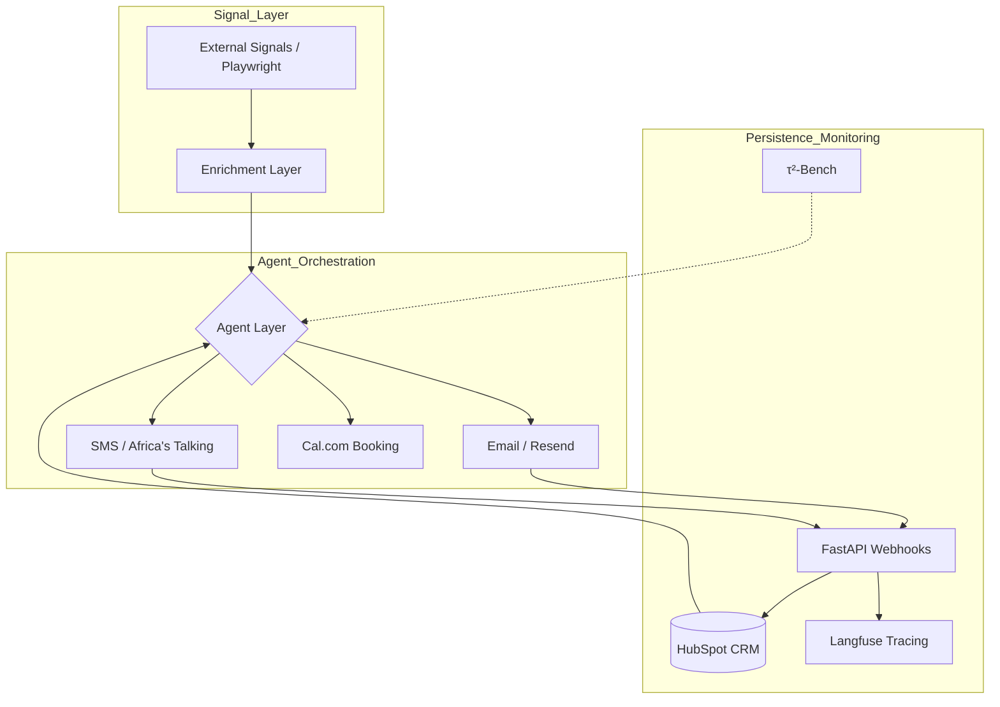

# 🚀 The Tenacious Conversion Engine  
**TRP1 Week 10 Challenge | Addisu Taye**

An AI-assisted multi-channel conversion system designed to automate the sales funnel—from identifying external job signals to booking meetings via Cal.com.

---

## 🏗️ System Architecture



---

## 🛠️ Production Stack Status

| Component       | Provider            | Status |
|----------------|---------------------|--------|
| Email          | Resend              | ✅ Verified |
| SMS            | Africa’s Talking    | ✅ Verified |
| CRM            | HubSpot Sandbox     | ✅ Verified |
| Observability  | Langfuse            | ✅ Verified |
| Booking        | Cal.com             | ✅ Verified (Local + Flow) |

---

## 📂 Repository Structure

```plaintext
agent/                  # Core Logic (FastAPI, Handlers)
configs/                # JSON Configs, Sample Data & Briefs
eval/                   # τ²-Bench, Score logs & Traces
scripts/                # Testing & Signal Fetching scripts
docker-compose.yml      # Infrastructure (Cal.com)
```

---

## 🚀 Getting Started

### 1. Installation

```bash
python -m venv venv
# Windows:
venv\Scripts\activate
# Mac/Linux:
source venv/bin/activate

pip install -r agent/requirements.txt
```

---

### 2. Environment Variables

Create a `.env` file:

```env
LANGFUSE_PUBLIC_KEY=your_key
LANGFUSE_SECRET_KEY=your_key
HUBSPOT_ACCESS_TOKEN=your_token
RESEND_API_KEY=your_key
AFRICASTALKING_API_KEY=your_key
CALCOM_BASE_URL=http://localhost:3000
```

---

### 3. Execution

```bash
# Start the API
uvicorn agent.app:app --reload --port 8000

# Run Evaluation (τ²-Bench)
cd eval/tau2-bench
uv run tau2 run --domain retail --agent-llm gpt-4 --num-tasks 3
```

---

## 📊 Performance & Metrics

### Enrichment Pipeline
- Job Signals: ✅ Playwright scraping implemented  
- Firmographics: ⚠️ Prototype structure established  
- Competitor Gap Analysis: ✅ Automated brief generation  

### Performance Logs
- Latency: Tracked via Langfuse (p50/p95 pending ≥20 interactions)  
- τ²-Bench: Smoke tests verified; full baseline pending  

---

## 🛡️ Data Handling

- Compliance: All prospects are synthetic; no real PII is processed  
- Drafting: All outreach outputs are treated as draft artifacts for human review  

---

## 📅 Roadmap

- **Act I:** Complete τ²-Bench baseline and latency profiling  
- **Act II:** Enhance scoring logic and Cal.com automation  
- **Act III:** Scale multi-channel orchestration and optimize latency  

---

## ✅ Summary

This system demonstrates:
- Full production stack integration  
- Multi-channel communication (Email + SMS)  
- CRM persistence and observability  
- End-to-end booking flow via Cal.com  
- Evaluation readiness using τ²-Bench  

A strong foundation is established for advanced intelligence and optimization phases.